# 🌱 GreenTrace - Carbon Footprint Tracker

<div align="center">


**A comprehensive web-based platform for companies to track, analyze, and reduce their carbon emissions**

[](https://reactjs.org/)
[](https://spring.io/projects/spring-boot)
[](https://www.mysql.com/)
[](https://vitejs.dev/)
[](https://tailwindcss.com/)
[](https://jwt.io/)

[Features](#-features) • [Tech Stack](#-tech-stack) • [Installation](#-installation) • [Usage](#-usage) • [API Docs](#-api-documentation) • [Team](#-team)

</div>

---

## 📋 Table of Contents

- [About](#-about)
- [Features](#-features)
- [Tech Stack](#-tech-stack)
- [Architecture](#-architecture)
- [Installation](#-installation)
- [Usage](#-usage)
- [API Documentation](#-api-documentation)
- [Project Structure](#-project-structure)
- [Screenshots](#-screenshots)
- [Database Schema](#-database-schema)
- [Future Scope](#-future-scope)
- [Contributing](#-contributing)
- [Team](#-team)
- [License](#-license)

---

## 🌍 About

**GreenTrace** is a full-stack web application designed to help companies monitor and manage their carbon footprint. Built as a 3rd-semester mini project for the Information Technology department at M.H. Saboo Siddik College of Engineering, GreenTrace combines modern web technologies with environmental sustainability goals.

### 🎯 Objectives

- **Track Emissions**: Calculate carbon footprint across Scope 1, 2, and 3 emissions
- **Visualize Data**: Real-time dashboard with emission trends and analytics
- **Gamification**: Reward companies with Green Points for consistent tracking
- **Industry Rankings**: Competitive leaderboard to motivate carbon reduction
- **Secure Access**: JWT-based authentication with BCrypt password encryption

---

## ✨ Features

### 🔐 Authentication
- User registration with company details
- Secure login with JWT token-based authentication
- Protected routes for authenticated users
- Automatic token refresh and session management

### 📊 Dashboard
- **Statistics Cards**: Total emissions, Green Points balance, Industry ranking
- **Emission Trends**: Visual charts showing monthly emission patterns
- **Recent Calculations**: History of last 10 carbon footprint calculations
- **Quick Actions**: Fast navigation to calculator and other features

### 🧮 Carbon Calculator
- **Multi-Step Form**: 4-step wizard for comprehensive data collection
  - **Step 1**: Scope 1 Emissions (Fuel combustion - Diesel, Petrol, Natural Gas, LPG)
  - **Step 2**: Scope 2 Emissions (Electricity consumption)
  - **Step 3**: Scope 3 Emissions (Transportation, Waste, Supply chain)
  - **Step 4**: Results with detailed breakdown and pie chart
- **Real-time Validation**: Input validation and error handling
- **Green Points Reward**: Earn points for each calculation

### 🏆 Leaderboard
- **Industry Rankings**: Top 10 companies with emission data
- **Medal Badges**: 🥇 Gold, 🥈 Silver, 🥉 Bronze for top 3
- **Industry Filter**: Filter by sector (IT, Manufacturing, Energy, etc.)
- **Search Function**: Find companies by name
- **User Highlight**: Current user's position highlighted

### 💰 Points History
- **Balance Card**: Current Green Points with trend indicator
- **Transaction List**: Complete history of earned/spent points
- **Statistics**: Total earned, total spent, net points
- **Date Filters**: Filter by week, month, or custom range
- **Transaction Icons**: Visual indicators for earn/spend activities

### 👤 Profile Management
- View and edit company information
- Change password functionality
- Account statistics overview
- Logout option

---

## 🛠️ Tech Stack

### Frontend
| Technology | Version | Purpose |
|------------|---------|---------|
| **React** | 19.1.1 | UI framework |
| **Vite** | 7.1.7 | Build tool & dev server |
| **Tailwind CSS** | 4.1.16 | Utility-first styling |
| **React Router DOM** | 7.9.5 | Client-side routing |
| **Axios** | 1.13.1 | HTTP client |
| **Lucide React** | 0.511.2 | Icon library |
| **React Hot Toast** | 2.4.1 | Toast notifications |

### Backend
| Technology | Version | Purpose |
|------------|---------|---------|
| **Spring Boot** | 3.5.7 | Backend framework |
| **Java** | 21 | Programming language |
| **Spring Security** | 6.3.x | Authentication & authorization |
| **Spring Data JPA** | 3.5.7 | Database ORM |
| **MySQL Connector** | 9.1.x | Database driver |
| **JWT (jjwt)** | 0.12.6 | Token generation |
| **Lombok** | 1.18.x | Boilerplate reduction |
| **Maven** | 3.9.x | Build automation |

### Database
| Technology | Version | Purpose |
|------------|---------|---------|
| **MySQL** | 8.0 | Relational database |

### DevOps & Tools
- **Git** - Version control
- **Postman** - API testing
- **VS Code** - Frontend IDE
- **IntelliJ IDEA** - Backend IDE
- **MySQL Workbench** - Database management

---

## 🏗️ Architecture

<div align="center">

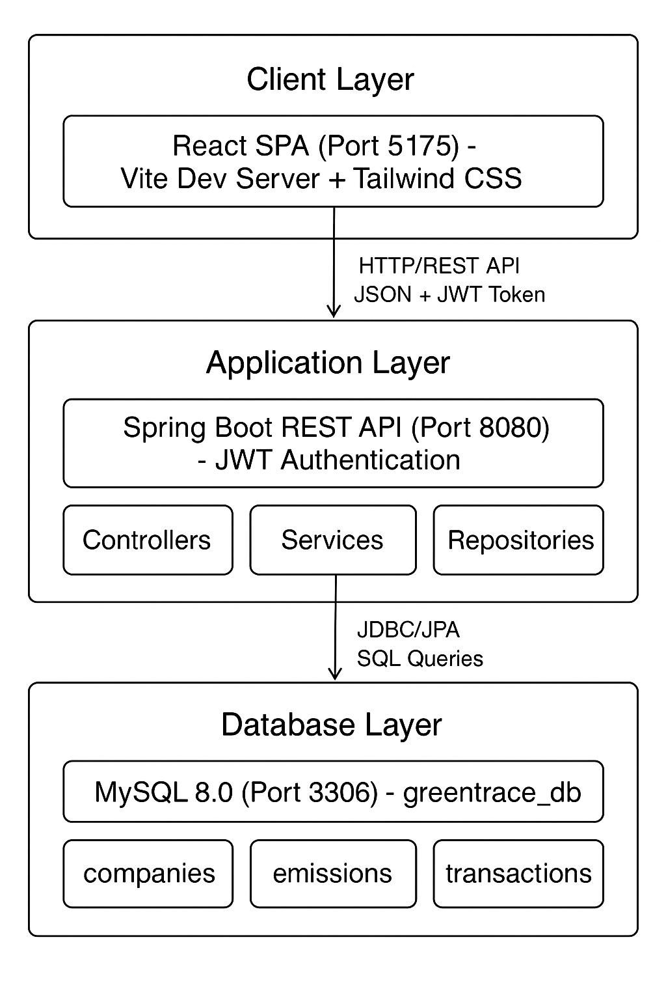

</div>

**Key Design Patterns:**
- **MVC Architecture**: Clear separation of concerns
- **Repository Pattern**: Data access abstraction
- **DTO Pattern**: Decoupling entities from API
- **JWT Authentication**: Stateless token-based auth
- **Context API**: Global state management (React)

---

## 📥 Installation

### Prerequisites
- **Node.js** (v20 or higher) - [Download](https://nodejs.org/)
- **Java JDK** (21 or higher) - [Download](https://www.oracle.com/java/technologies/downloads/)
- **MySQL** (8.0 or higher) - [Download](https://dev.mysql.com/downloads/)
- **Maven** (3.9 or higher) - [Download](https://maven.apache.org/download.cgi)
- **Git** - [Download](https://git-scm.com/)

### 1️⃣ Clone Repository

```bash
git clone https://github.com/yourusername/greentrace2.0.git
cd greentrace2.0
```

### 2️⃣ Database Setup

```bash
# Login to MySQL
mysql -u root -p

# Create database
CREATE DATABASE greentrace_db;

# Exit MySQL
exit;
```

### 3️⃣ Backend Setup

```bash
# Navigate to backend directory
cd backend

# Update database credentials in src/main/resources/application.properties
# Change password to your MySQL password
spring.datasource.password=YOUR_PASSWORD

# Install dependencies and run
mvn clean install
mvn spring-boot:run

# Backend will start on http://localhost:8080
```

### 4️⃣ Frontend Setup

```bash
# Navigate to frontend directory
cd ../frontend

# Install dependencies
npm install

# Start development server
npm run dev

# Frontend will start on http://localhost:5175
```

### 5️⃣ Access Application

Open your browser and navigate to:
- **Frontend**: http://localhost:5175
- **Backend API**: http://localhost:8080/api

---

## 🚀 Usage

### Registration & Login

1. **Register New Company**
   - Navigate to registration page
   - Fill in company details (Name, Industry, Email, Password)
   - Click "Register"

2. **Login**
   - Enter registered email and password
   - JWT token generated and stored in localStorage
   - Redirected to Dashboard

### Calculate Carbon Footprint

1. Navigate to **Calculator** from navbar
2. **Step 1**: Select fuel type and enter quantity (Scope 1)
3. **Step 2**: Enter electricity consumption in kWh (Scope 2)
4. **Step 3**: Enter transportation and waste data (Scope 3)
5. **Step 4**: View results with breakdown and earn Green Points

### View Leaderboard

1. Navigate to **Leaderboard** from navbar
2. See your ranking among all companies
3. Filter by industry sector
4. Search for specific companies

### Track Points History

1. Navigate to **Points History** from navbar
2. View current balance and statistics
3. See complete transaction history
4. Filter by date range

---

## 📚 API Documentation

### Base URL
```
http://localhost:8080/api
```

### Authentication Endpoints

#### Register
```http
POST /api/auth/register
Content-Type: application/json

{
  "email": "company@example.com",
  "password": "SecurePass123",
  "companyName": "Tech Corp",
  "industry": "IT",
  "location": "Mumbai",
  "contactPerson": "John Doe",
  "phone": "9876543210"
}

Response: 200 OK
{
  "token": "eyJhbGciOiJIUzI1NiIs...",
  "user": {
    "id": 1,
    "email": "company@example.com",
    "companyName": "Tech Corp",
    "greenPoints": 0
  }
}
```

#### Login
```http
POST /api/auth/login
Content-Type: application/json

{
  "email": "company@example.com",
  "password": "SecurePass123"
}

Response: 200 OK
{
  "token": "eyJhbGciOiJIUzI1NiIs...",
  "user": { ... }
}
```

### Emission Endpoints

#### Calculate Emissions
```http
POST /api/emissions/calculate
Authorization: Bearer <token>
Content-Type: application/json

{
  "scope1FuelType": "DIESEL",
  "scope1Quantity": 100,
  "scope2Electricity": 500,
  "scope3Transportation": 200,
  "scope3Waste": 50
}

Response: 200 OK
{
  "id": 1,
  "totalEmissions": 1875.25,
  "scope1Emissions": 680.0,
  "scope2Emissions": 850.0,
  "scope3Emissions": 345.25,
  "greenPointsEarned": 187
}
```

#### Get Dashboard
```http
GET /api/emissions/dashboard
Authorization: Bearer <token>

Response: 200 OK
{
  "totalEmissions": 12450.75,
  "greenPoints": 450,
  "rank": 3,
  "industryRank": 1,
  "emissionTrend": [...],
  "recentCalculations": [...]
}
```

### Leaderboard Endpoints

#### Get Rankings
```http
GET /api/leaderboard?industry=IT
Authorization: Bearer <token>

Response: 200 OK
[
  {
    "rank": 1,
    "companyName": "Green Corp",
    "industry": "IT",
    "totalEmissions": 5000.0,
    "greenPoints": 800
  },
  ...
]
```

### Points Endpoints

#### Get Transaction History
```http
GET /api/points/transactions?page=0&size=10
Authorization: Bearer <token>

Response: 200 OK
{
  "content": [
    {
      "id": 1,
      "transactionType": "EARNED",
      "amount": 187,
      "description": "Emission calculation completed",
      "balanceAfter": 450,
      "createdAt": "2025-10-30T14:30:00"
    },
    ...
  ],
  "totalPages": 5
}
```

---

## 📂 Project Structure

```
greentrace2.0/
├── backend/                          # Spring Boot Backend
│   ├── src/main/java/com/greentrace/
│   │   ├── config/                   # Security, CORS, JWT config
│   │   ├── controller/               # REST API endpoints
│   │   ├── dto/                      # Data Transfer Objects
│   │   ├── entity/                   # JPA entities
│   │   ├── repository/               # Database repositories
│   │   ├── service/                  # Business logic
│   │   └── util/                     # Utility classes
│   ├── src/main/resources/
│   │   └── application.properties    # Database config
│   └── pom.xml                       # Maven dependencies
│
├── frontend/                         # React Frontend
│   ├── src/
│   │   ├── components/               # React components
│   │   │   ├── auth/                 # Login, Register
│   │   │   ├── common/               # Reusable UI components
│   │   │   ├── dashboard/            # Dashboard components
│   │   │   ├── calculator/           # Calculator steps
│   │   │   ├── leaderboard/          # Leaderboard components
│   │   │   ├── points/               # Points history
│   │   │   └── layout/               # Navbar, Footer
│   │   ├── context/                  # React Context (Auth)
│   │   ├── hooks/                    # Custom hooks
│   │   ├── pages/                    # Page components
│   │   ├── services/                 # API services
│   │   ├── utils/                    # Utility functions
│   │   ├── App.jsx                   # Main app component
│   │   └── main.jsx                  # Entry point
│   ├── package.json                  # NPM dependencies
│   ├── vite.config.js                # Vite configuration
│   └── tailwind.config.js            # Tailwind CSS config
│
├── docs/                             # Documentation
│   ├── PROJECT_STRUCTURE.md          # Detailed structure
│   └── CHAPTER_5_6_7_8.txt          # Report chapters
│
└── README.md                         # This file
```

For detailed structure, see [PROJECT_STRUCTURE.md](docs/PROJECT_STRUCTURE.md)

---

## 📸 Screenshots

### 🏠 Landing Page
<div align="center">
  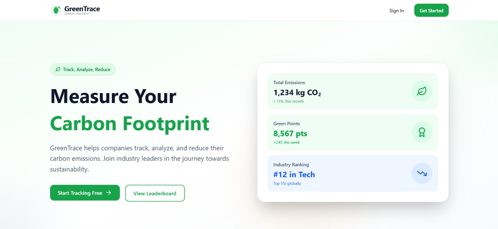
</div>

*Welcome page with hero section and call-to-action buttons*

---

### 📝 Registration Page
<div align="center">
  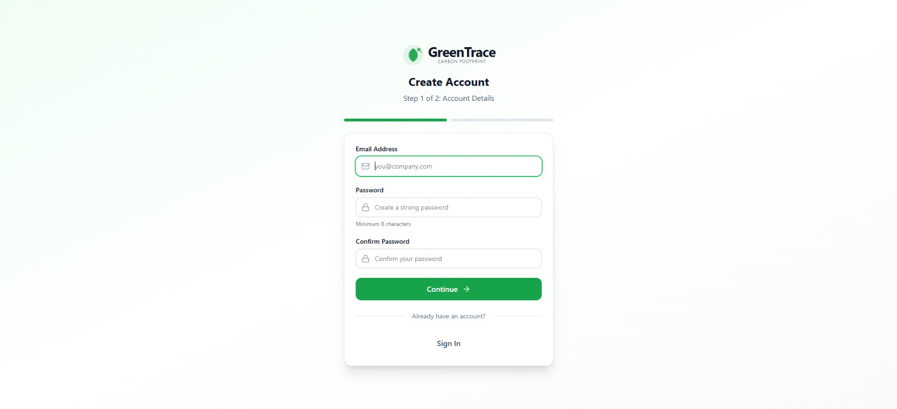
  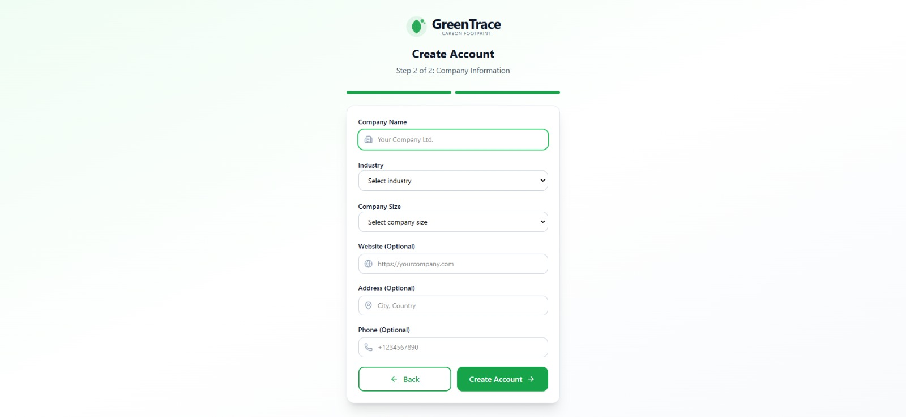
</div>

*Multi-step registration form with company details and validation*

---

### 🎯 Features Overview
<div align="center">
  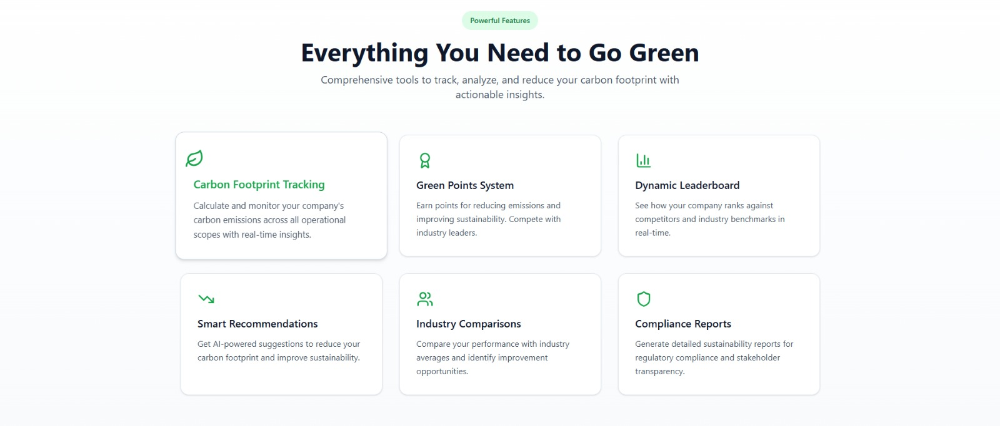
</div>

*Key features showcase with interactive cards*

---

### 📊 Dashboard - Initial View
<div align="center">
  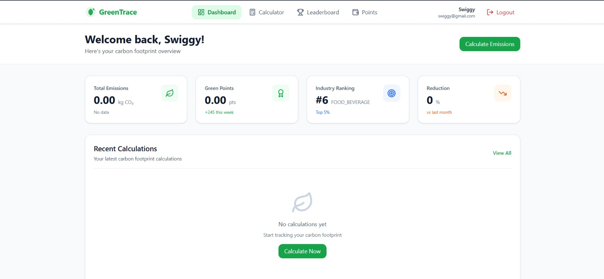
</div>

*Clean dashboard for new users with quick action buttons*

---

### 📈 Dashboard - With Data
<div align="center">
  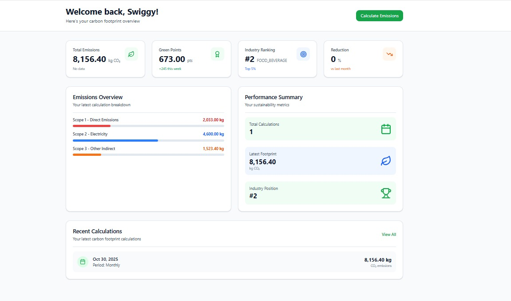
</div>

*Comprehensive dashboard showing emission stats, green points, and recent calculations*

---

### 🧮 Carbon Calculator - Scope 1
<div align="center">
  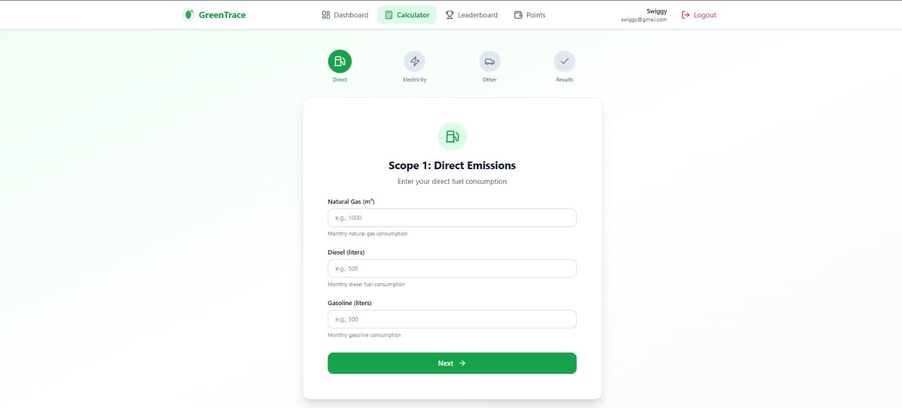
</div>

*Fuel combustion input with fuel type selection and quantity*

---

### ⚡ Carbon Calculator - Scope 2
<div align="center">
  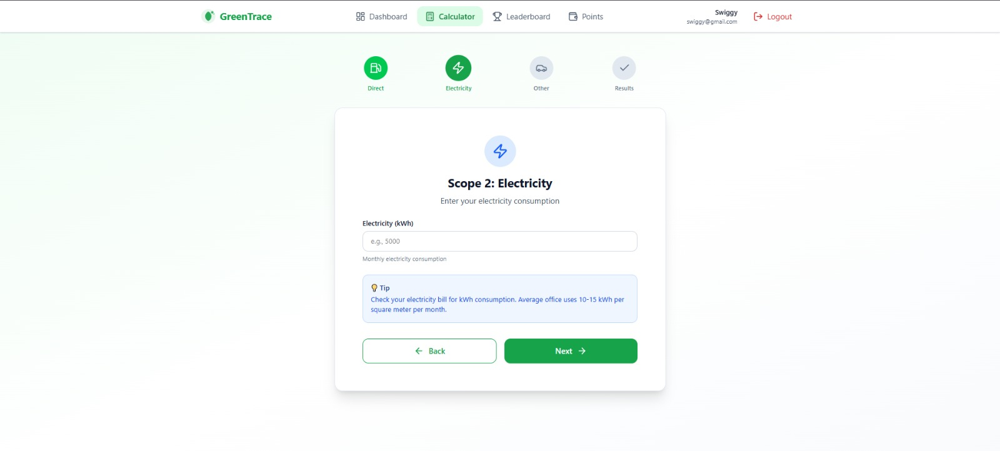
</div>

*Electricity consumption input for Scope 2 emissions*

---

### 🚗 Carbon Calculator - Scope 3
<div align="center">
  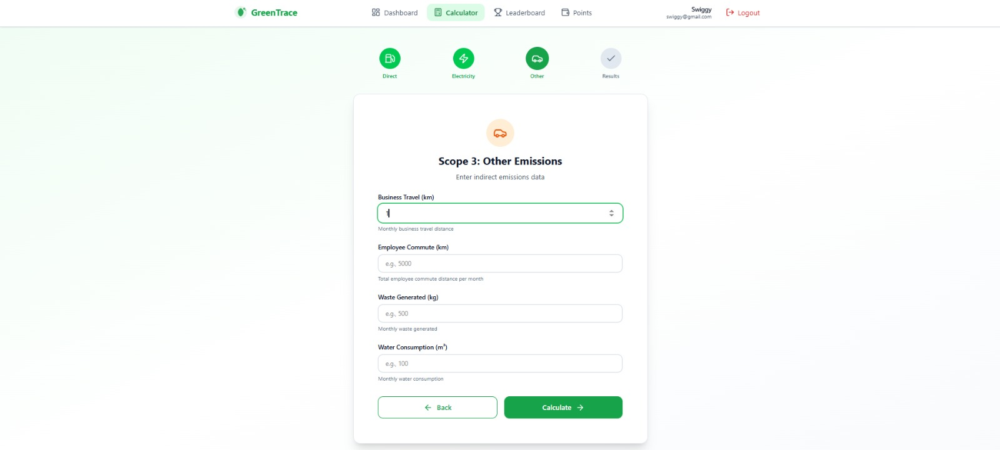
</div>

*Transportation and waste data input for Scope 3 emissions*

---

### 🎉 Calculation Results
<div align="center">
  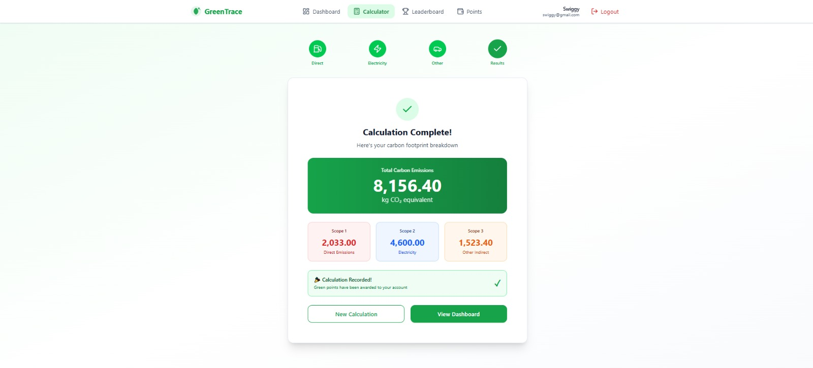
</div>

*Detailed emission breakdown with pie chart and green points earned*

---

### 🏆 Leaderboard
<div align="center">
  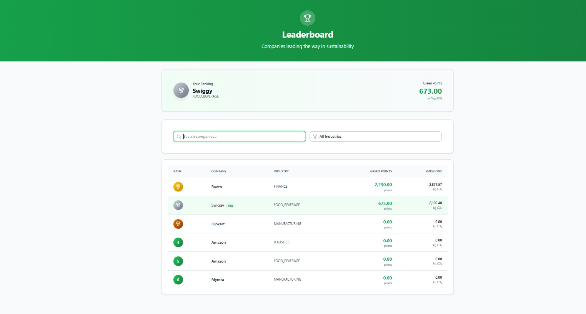
</div>

*Industry rankings with top companies, medal badges, and filtering options*

---

## 🗄️ Database Schema

### Companies Table
```sql
CREATE TABLE companies (
  id BIGINT AUTO_INCREMENT PRIMARY KEY,
  email VARCHAR(255) UNIQUE NOT NULL,
  password VARCHAR(255) NOT NULL,
  company_name VARCHAR(255) NOT NULL,
  industry VARCHAR(100) NOT NULL,
  location VARCHAR(255),
  contact_person VARCHAR(255),
  phone VARCHAR(20),
  green_points INT DEFAULT 0,
  created_at TIMESTAMP DEFAULT CURRENT_TIMESTAMP,
  updated_at TIMESTAMP DEFAULT CURRENT_TIMESTAMP ON UPDATE CURRENT_TIMESTAMP
);
```

### Emission Calculations Table
```sql
CREATE TABLE emission_calculations (
  id BIGINT AUTO_INCREMENT PRIMARY KEY,
  company_id BIGINT NOT NULL,
  scope1_fuel_type VARCHAR(50),
  scope1_quantity DECIMAL(10,2),
  scope1_emissions DECIMAL(10,2),
  scope2_electricity DECIMAL(10,2),
  scope2_emissions DECIMAL(10,2),
  scope3_transportation DECIMAL(10,2),
  scope3_waste DECIMAL(10,2),
  scope3_emissions DECIMAL(10,2),
  total_emissions DECIMAL(10,2),
  green_points_earned INT,
  calculated_at TIMESTAMP DEFAULT CURRENT_TIMESTAMP,
  FOREIGN KEY (company_id) REFERENCES companies(id)
);
```

### Green Points Transactions Table
```sql
CREATE TABLE green_points_transactions (
  id BIGINT AUTO_INCREMENT PRIMARY KEY,
  company_id BIGINT NOT NULL,
  transaction_type ENUM('EARNED', 'SPENT') NOT NULL,
  amount INT NOT NULL,
  description VARCHAR(500),
  balance_after INT NOT NULL,
  created_at TIMESTAMP DEFAULT CURRENT_TIMESTAMP,
  FOREIGN KEY (company_id) REFERENCES companies(id)
);
```

---

## 🔮 Future Scope

- **AI-Powered Recommendations**: Machine learning for emission reduction suggestions
- **Mobile Application**: React Native app for Android/iOS
- **Blockchain Integration**: Tokenize green points as carbon credits
- **IoT Device Integration**: Smart meters for automatic data collection
- **Advanced Analytics**: Custom report generation (PDF/Excel)
- **Cloud Deployment**: AWS/Azure with auto-scaling
- **Multi-Language Support**: Internationalization (Hindi, Marathi, etc.)
- **Carbon Offset Marketplace**: Direct investment in sustainability projects
- **Compliance Tracking**: ISO 14064, GHG Protocol standards
- **Social Features**: Company collaboration and challenges

For detailed future scope, see [PROJECT_STRUCTURE.md](docs/PROJECT_STRUCTURE.md#-future-scope)

---

## 🤝 Contributing

Contributions are welcome! Please follow these steps:

1. Fork the repository
2. Create a feature branch (`git checkout -b feature/AmazingFeature`)
3. Commit your changes (`git commit -m 'Add some AmazingFeature'`)
4. Push to the branch (`git push origin feature/AmazingFeature`)
5. Open a Pull Request

---

## 👥 Team

**Project Group:**
- **Khan Imamuddin** (241423) - [GitHub](https://github.com/username) | [LinkedIn](https://linkedin.com/in/username)
- **Rizvi Kazim** (241439) - [GitHub](https://github.com/username) | [LinkedIn](https://linkedin.com/in/username)
- **Sande Samad** (241440) - [GitHub](https://github.com/username) | [LinkedIn](https://linkedin.com/in/username)
- **Sayed Zayar** (241442) - [GitHub](https://github.com/username) | [LinkedIn](https://linkedin.com/in/username)

**Supervisor:**  
Dr. Ashfaq Shaikh

**Institution:**  
M.H. Saboo Siddik College of Engineering  
Department of Information Technology  
University of Mumbai  
Academic Year: 2025-2026

---

## 📄 License

This project is licensed under the MIT License - see the [LICENSE](LICENSE) file for details.

---

## 🙏 Acknowledgments

- **Dr. Ashfaq Shaikh** - Project supervisor and mentor
- **HOD & Faculty** - Department of Information Technology
- **M.H. Saboo Siddik College of Engineering** - Infrastructure and support
- **Open Source Community** - For amazing libraries and frameworks

---

## 📞 Contact

For queries or suggestions, reach out to:
- **Email**: greentrace.project@gmail.com
- **Project Link**: [https://github.com/RizviKazim72/greentrace2.0](https://github.com/RizviKazim72/greentrace2.0)

---

<div align="center">

**Made with 💚 for a sustainable future**

⭐ Star this repo if you find it helpful!

</div>
